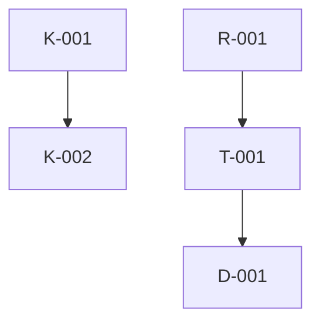

# Neural Memory Layer

## Purpose
This memory layer acts as the permanent, structured context for the IMAM ESTUDIO platform to ensure AI consistency across sessions.

## Startup Sequence
1. Always load `01_foundation_knowledge/K-001_core_identity.md`.
2. Always load `05_decisions_ledger/D-001_active_decisions.md`.
3. Load task-relevant context based on the current objective.

## Neuron Registry
- **K-001**: Core brand identity and intent.
- **K-002**: TAM and marketplace context.
- **R-001**: Freelancer/Client psychology.
- **R-002**: Competitive landscape.
- **X-001**: Security and privacy risks.
- **X-002**: Legal compliance risks.
- **T-001**: System architecture.
- **T-002**: Core features matrix.
- **T-003**: Incident response protocol.
- **D-001**: Active decisions.
- **D-002**: Tradeoffs archive.
- **L-001**: Telemetry and KPIs feedback.

## Knowledge Graph

## Post-Work Update Protocol
Update relevant neurons after architectural changes. Use `_templates/neuron.md` for new files.
